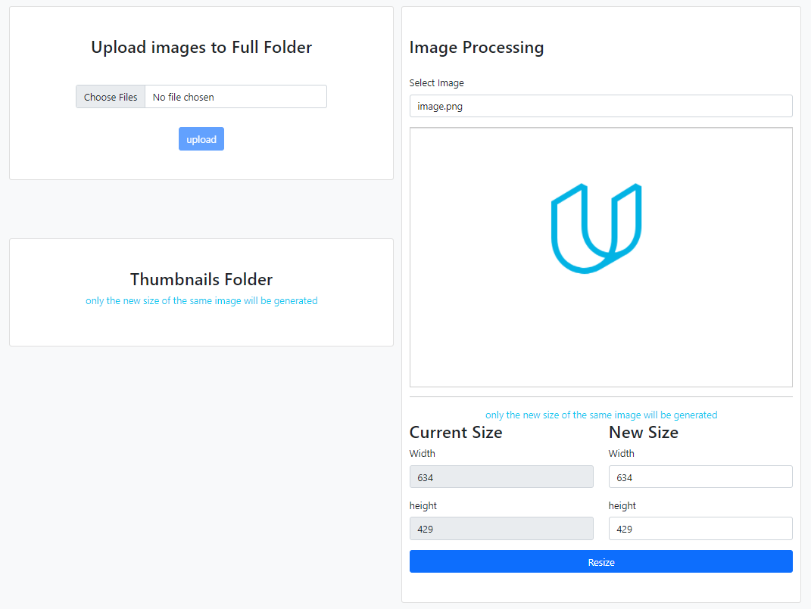

# udacity Image Processing

-----

## overview

This is a simple API that can be used in two different ways. The first, as a simple placeholder API that allows us to
place images into our frontend with the size set via url parameters. second as a library to serve properly scaled
versions of our images to the frontend to reduce page load size.

### Getting started

to get this project up and running one will need to: 

1. install needed dependencies
2. build and execute the application

### installation

to install the dependencies download/clone the source code then step into root folder and run the below command
> npm install

### build phase

to build the application run the below command, it will transpile the typescript code to normal javascript code inside
the `build` folder
> npm run build

### Start Application

to start the application run the below command , it will start the server on port `3000`
and the front-end will be accessible at `http://localhost:3000`
> npm start

### Application Home Page `http://localhost:3000`

### APIs

|  API | METHOD  | Description |
| ------|  ----- | ----------- |
| `http://localhost:3000` |  |  main page for the front-end application |
| `http://localhost:3000/api/images?filename=image.png&width=100&height=200`| `GET` | resize endpoint need 3 params `filename`,`width` and `height` and makes sure that image exists in `full` folder or it will throw exception `400` |
| `http://localhost:3000/api/images/full` | `GET` | retrieve list of images with full size from `full` folder |
| `http://localhost:3000/api/images/thumbnails` | `GET` | retrieve list of resized images with from `thumb` folder |
| `http://localhost:3000/api/images/upload` | `POST` | to upload images to `full` folder which can use it later for resizing endpoint  send `multipart/form-data` with `files` as key and value your uploaded image|

### Testing and Linting

-----

below is some scripts I used it while developing this application to make the code readable and clean also to force me
follow best practice

| Script      | Description |
| ----------- | ----------- |
| `npm run prettier`      | ensures that all outputted code conforms to a consistent style. |
| `npm run lint`   | ESLint statically analyzes your code to quickly find problems and help you to fix it |
| `npm run jasmine` | to run  the unit test for the code but this work on the `./build` folder means make sure that you build the application first |
| `npm run test`| this to make build then run the jasmine internally to unit test the application |
